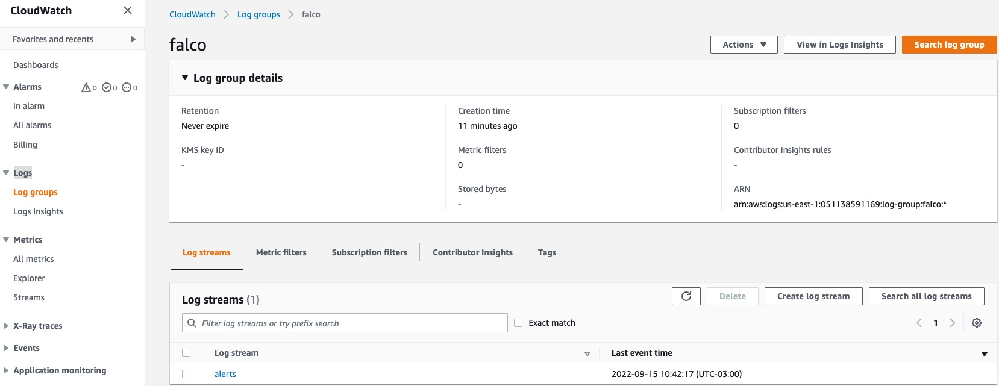
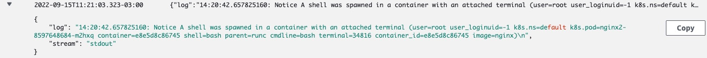
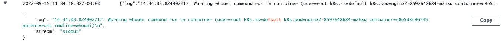

# Container Runtime Security with Falco (Credits to Lucas Soriano lucasdu@)

O [Falco](https://falco.org/) é um projeto open-source de segurança em tempo de execução para detecção de ameaças. Ele se tornou o principal mecanismo para detecção de ameaças para ambientes Kubernete, funcionando como uma câmera de segurança que detecta comportamentos inesperados, invasões e roubo de dados em tempo real em aplicações e containers.

Nesse workshop vamos implementar Falco no nosso cluster do Amazon EKS, integra-lo ao CloudWatch e criar métricas customizadas atacando o ítem Runtime Security do nosso guia Amazon EKS Best Practices Guide for Security (https://aws.github.io/aws-eks-best-practices/security/docs/).

Antes de iniciarmos, acesse a pasta do repositório criado pelo Lucas no seu Cloud9
```bash
cd eks-security-with-falco
```


## Implementando o Fluent Bit

O Fluent Bit é um gerenciador de Logs de código aberto e multiplataforma que permite coletar dados/logs de diferentes fontes, unificá-los e enviá-los para destinos diversos. É totalmente compatível com ambientes Docker e Kubernetes. Utilizaremos o Fluent Bit para exportar os logs do Falco para o CloudWatch Logs.

Para usar roles do IAM para service accounts do cluster, primeiro criaremos um OIDC identity provider.

```bash
eksctl utils associate-iam-oidc-provider \
    --cluster eks-security-workshop \
    --approve
```

Podemos associar a IAM Role para service accounts no Amazon EKS diretemente aos Pods e não mais ao nó do cluster, como ocorria até algum tempo atrás.

Vamos agora criar uma IAM role para o service account do fluent-bit no namespace chamado logging.

```bash
kubectl create namespace logging

eksctl create iamserviceaccount \
    --name fluent-bit \
    --namespace logging \
    --cluster eks-security-workshop \
    --attach-policy-arn "arn:aws:iam::aws:policy/AdministratorAccess" \
    --approve \
    --override-existing-serviceaccounts
```
Verifique se sua service account tem uma Annotation com o ARN da role do IAM

```bash
kubectl -n logging describe sa fluent-bit
```

Implemente o Fluent Bit

```bash
kubectl apply -f fluent-bit/
```

Tenha certeza de que todos os Pods estejam em status "Running"

```bash
kubectl --namespace=logging get pods
```
## Instalando o Falco

Adicione o repositório Helm do Falco

```bash
helm repo add falcosecurity https://falcosecurity.github.io/charts && helm repo update
```

Instale o pacote Helm do Falco com valores default

```bash
helm install falco falcosecurity/falco
```

Assim que a instalação estiver completa o Falco começará a escanear os Pods e irá expor logs para Stdout. O fluent-bit irá então exportar esses logs para o CloudWatch Logs.

Abra a console do CloudWatch Logs e verifique se o existe um Log Group para o Falco

<p align="center"> 

</p>

Abra o Log Stream **alerts**. Nele teremos os logs gerados pelo Falco.

## Implementando uma aplicação para teste

Instale o NGINX para usarmos como nossa app de teste.

```bash
kubectl apply -f deployment/
```
## Testando as regras default

Antes de criar regras personalizadas, vamos testar a regra default. Para isso vamos iniciar um Shell dentro de um dos Pods NGINX

```bash
kubectl exec -it $(kubectl get po | grep -i nginx | awk '{print $1}' | head -n1) -- /bin/bash
```
Olhe agora no Log Stream **alerts** do CloudWatch Logs.

<p align="center"> 

</p>

Veja que o Falco detectou que um Shell foi iniciado no container NGINX.

## Criando regras customizadas

O Falco permite criar [regras customizadas](https://falco.org/docs/rules/) usando YAML. Você pode passar valores customizados para o chart Helm do Falco quando inicializa-lo ou atualiza-lo.

Vamos agora criar uma regra customizada que irá nos notificar toda vez que o comando 'whoami'rodar dentro de um container.

```yaml
- rule: The program "locate" is run in a container
      desc: An event will trigger every time you run "locate" in a container
      condition: evt.type = execve and evt.dir=< and container.id != host and proc.name = locate
      output: "locate command run in container (user=%user.name %container.info parent=%proc.pname cmdline=%proc.cmdline)"
      priority: NOTICE
      warn_evttypes: False
```

Execute o comando a seguir para atualizar o chart com o valor customizado

```shell
helm upgrade falco -f custom-rules/custom-rules.yaml falcosecurity/falco

kubectl get po -ndefault -w
```

Assim que os Pods do Falco estiverem com status **running**, vamos logar em um container e executar o comando 'whoami'.

```shell
kubectl exec -it $(kubectl get po | grep -i nginx | awk '{print $1}' | head -n1) -- whoami
```

Volte ao Log Group do Falco e check se ele logou a execução do comando.

<p align="center"> 

</p>

